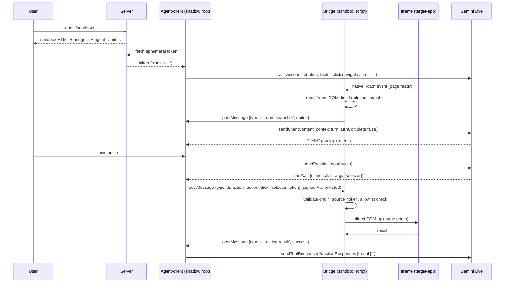

# AI Presenter Agent — Rebuild Spec (v2)

> Source: reconstructed from a v1 project built at Demostack (2025-present). This doc is the brief
> for this v2 build. Facts marked **[assume]** are the author's best recollection or a proposed
> best-practice filled in where memory was fuzzy — treat them as a starting decision, not ground
> truth from the original system.

## v2 build scope (read this first)

This build deliberately **excludes the agent-creation side** of the product: the config UI wizard,
the template/demo-agent data model, RAG upload/indexing, the Editor flow builder, and the async
build+polling pipeline. None of that is where the interesting engineering is — the point of this
rebuild is the **runtime**: an agent embedded in a sandbox, grounded in a live DOM, taking real
actions, talking over a live voice model, hardened the way v1 wasn't.

It also **does not clone a real external site**. Instead of Demostack's actual crawl-and-clone
engine, this build uses a small authored "target app" served same-origin with the sandbox — see
[`sandbox-simulation.md`](./sandbox-simulation.md) for exactly why, and what that trades off.

## 1. Product context

Demostack's core product clones a target web app — capturing its network traffic (APIs, JS
bundles, static assets) — into its own datastore and republishes it as an editable, endlessly
forkable **demo**, hosted on its own domain. A demo can be tweaked (data, design, copy) to tell a
different story for a different audience without standing up new infrastructure per story.

Historically, telling that story required a human presenter narrating the demo live. The
**Presenter Agent** replaces that human: an AI agent embedded directly inside a demo that knows
the app and the specific demo's purpose, and can both *talk* (narrate, answer questions) and *act*
(navigate, click, scroll, fill forms) inside the cloned app — live, in front of the viewer.

## 2. Goals for v2

Everything in v1 worked and shipped. These are the specific things to design in from day one
rather than retrofit — this list is the actual build checklist for this repo:

| # | v1 gap | v2 goal |
|---|--------|---------|
| 1 | `postMessage` bridge between agent and sandbox had no origin/token validation | Validate `event.origin` + `event.source`, and sign every message with the live session token |
| 2 | Action-execution library lived on `window` — reachable directly, bypassing any message validation | Keep it in a closure only the message handler can call; never attach it to a global |
| 3 | Action dispatch likely indexed an object by a string that ultimately traces back to model output | Explicit allowlist/switch over known action names before dispatch — never dynamic property access on untrusted input |
| 4 | Agent sometimes hallucinated navigation targets that don't exist | Constrain *all* navigation (scripted flow steps **and** live/freeform decisions) to the same crawled-route allowlist — realized here as native Gemini function-calling with an enum of known pages, so the model literally cannot emit an unknown target |
| 5 | Repetition loops (agent repeats a sentence/action) | Loop guard: cap consecutive identical actions/utterances, force escalation past the cap |
| 6 | Dropped WebSocket/Live session was silent to the user (volume graph + mic just vanish) | Explicit reconnecting / failed states, with a manual retry affordance on final failure |
| 7 | DOM grounding shape was informal / undocumented | Formal reduced snapshot: interactive/labeled nodes only, diffed against the last snapshot, size-capped |
| 8 | Avatar subtree re-rendered on every audio tick (isolate + memoize was the v1 fix) | Go further: volume held in a ref, bars updated imperatively via rAF — zero React re-renders for that value |
| 9 | No regression test proving the render isolation actually holds | Render-count test: assert sibling components' render counts stay flat under a burst of simulated volume updates |
| 10 | Template edits' effect on already-created demo-agents was never verified | Out of scope for this build (no template/demo-agent model here) — documented for the full-product build later |

## 3. Functional requirements (this build)

- A **sandbox** page hosting an `<iframe>` pointing at the target-app, same-origin.
- A **target-app**: a couple of static pages with a handful of labeled interactive elements
  (nav link, button, form) — the stand-in for a "cloned app."
- An **agent-client**: a prebuilt script + custom element, mounted into a shadow root in the
  sandbox, that connects directly to Gemini Live, converses by voice, and dispatches actions.
- A minimal **server**: mints a short-lived ephemeral token for Gemini Live (the only thing it
  does — see §5.4) and serves the static bundles.

## 4. Architecture overview

```mermaid
flowchart LR
    subgraph Sandbox["Sandbox (single top-level document)"]
      AgentClient["Agent-client\n(React, mounted in shadow root)"]
      Bridge["Bridge / action library\n(closure-scoped, NOT on window)"]
      Iframe["Target-app (iframe, same-origin)"]
    end
    Server[("Server\n(mints ephemeral token only)")]
    Gemini["Gemini Live"]

    Server -. ephemeral token, once .-> AgentClient
    AgentClient <-->|Live API: audio + tool calls| Gemini
    AgentClient <-->|window.postMessage\norigin+token checked, allowlisted| Bridge
    Bridge -->|direct DOM ops\n(same-origin, no 2nd postMessage needed)| Iframe
    Iframe -->|native iframe 'load' event\n+ DOM read on load/nav| Bridge
```

Two independent bundles share one browser window: the **agent-client** (its own deployable unit,
mounted in a shadow root) and the **sandbox bridge** (the host page's own script, holding the
action library). They talk via `window.postMessage` even though they're same-origin and could in
principle share a module — that's a deliberate decoupling choice carried over from v1, not an
accident of iframe communication. See [`sandbox-simulation.md`](./sandbox-simulation.md) for the
full mechanics of that bridge and why the iframe itself never gets a second postMessage hop.

### 4.1 Runtime sequence



## 5. Component specs

### 5.1 Target-app

A couple of static pages (Home, Settings) each with a small number of interactive elements marked
with `data-testid` — the stable selector the snapshot exposes and actions target. No framework
needed; this is intentionally the simplest piece.

### 5.2 Sandbox / bridge

- Detects "ready" via the iframe's own native `load` event — simpler and more reliable than a
  postMessage handshake, and available precisely *because* the target is same-origin static pages
  (an SPA-in-iframe target would still need the target to announce readiness itself after a
  client-side route change; noted in `sandbox-simulation.md`).
- Owns the reduced DOM snapshot (see §5.3) and the action library — both live in a module closure,
  never on `window` (v2 goal #2).
- Validates every inbound `ds-action` message: `event.origin` matches the sandbox's own origin,
  the message carries the current session token, and the action name is in an explicit allowlist
  before dispatch (v2 goals #1, #3).

### 5.3 DOM grounding snapshot

- Flattened list of interactive/meaningful nodes only: role/tag, accessible name/label, the
  `data-testid`-based selector, visibility/enabled flag.
- Diffed against the last snapshot sent — only changed nodes go out again.
- Size-capped (top N elements) so a larger page can't blow the model's context.

### 5.4 Server

Does exactly one job: mint a single-use, short-lived Gemini Live ephemeral token
(`client.authTokens.create()`) using the real API key, which never leaves the server. Also serves
the static sandbox/target-app/agent-client bundles. Nothing else is proxied — audio and tool-call
events go directly from the browser to Gemini Live.

### 5.5 Agent-client

- Connects to Gemini Live with `tools` = function declarations for `click`, `navigate` (enum of
  known routes — closes v2 goal #4 directly), `scroll`, `fill`.
- On a `toolCall` message: dispatch to the bridge via `postMessage`, await the correlated result,
  call `session.sendToolResponse()` with it. This action-result loop is the primary grounding
  signal — no screenshots.
- Loop guard: caps consecutive identical action/utterance signatures; past the cap, injects a
  corrective context turn instead of dispatching again (v2 goal #5).
- Reconnect: real backoff (immediate, 1s, 3s, 7s, 15s, 30s — 6 attempts) around `ai.live.connect`;
  on final failure, shows a visible failed state with a manual retry button (v2 goal #6).
- Volume meter: volume value lives in a ref, bars update imperatively via `requestAnimationFrame`
  — no React state, no re-renders for that value at all (v2 goal #8, the "go further" option from
  the deep-dive doc).

### 5.6 Testing

- Render-count test on the sibling components (avatar image, transcript log) asserting their
  render counts stay flat under a burst of simulated volume updates (v2 goal #9).
- A unit test for the bridge's origin/token/allowlist validation — the exact gap v1 shipped with.

## 6. Open questions

- Exact size cap for the DOM snapshot — start with a number, tune once it's running.
- Loop-guard threshold — start at 3 repeats, tune from there.
- Whether to also demonstrate the "point at a real external site" path (thin same-origin proxy) —
  deliberately deferred; see `sandbox-simulation.md` §4.
